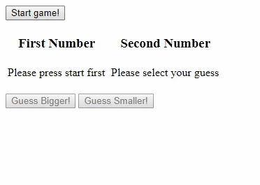

# Day 6 Task : Guessing Game
*Yeah, you read that right. We have task title now :D*

## Problem
Guessing game is a game with a simple rule. First you'll generate a random number. Second you'll guess, whether the next number is bigger or smaller than the first one. Last you'll generate a random number to compare with the first one. Give notice whether you're right or wrong.
Create a vanilla javascript script to create guessing game.

## Example Screens

## Notes
Take notes for some event:
* Guess buttons are disabled before user start the game
* Pressing guess will generate both second random number and the result
* There must only one result on screen
* On start game, remove second number and current result* 

You're free to style it as you likes. 
Submit it to my telegram (@alvinmatias69), whatsapp (+62 - 838 - 2045 - 4046), or email (alvinmatias@protonmail.com). 
Next task will be given after you've solved this task.